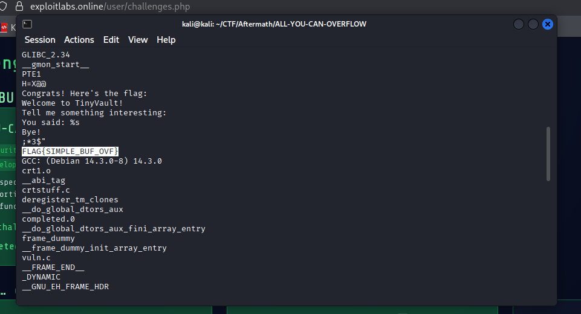

# All You Can Buffer Overflow

The challenge provides us with an executable and implies to perform a buffer overflow on it in order to get the flag.

---

## Solution

- First let's run the executable and see it's behavior.

```sh
chmod +x vuln
./vuln
```

- It asks for an input and closes. So the challenge is indeed directing us for a buffer overflow. However, the flag could be a plain string. So let's check the strings of the file and see if there is a flag.

```sh
strings vuln
```



- Indeed the flag is there and completely bypassed the buffer overflow step.