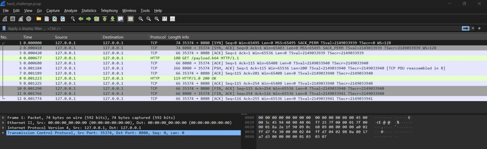
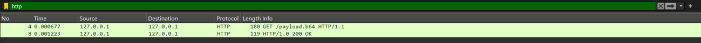
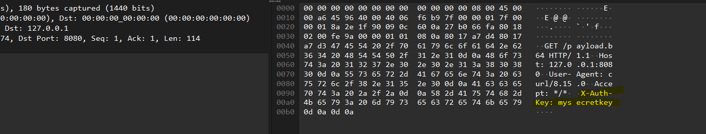
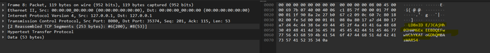
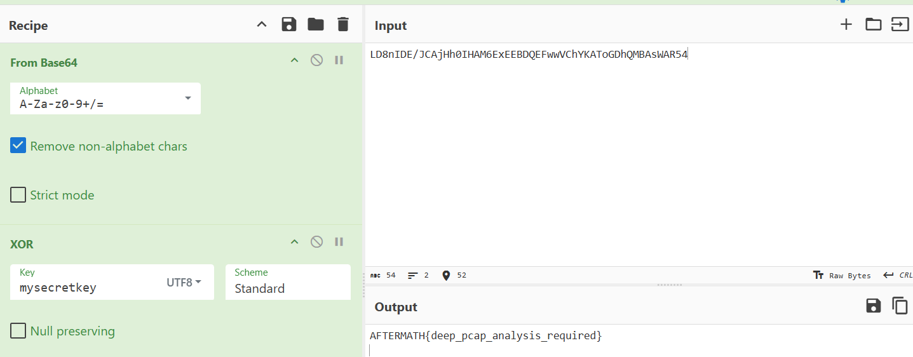

# Deep Packet Secrets

You are given a .pcap file to analyze. Among the network traffic lies the flag.

---

## Solution

- First, I have opened the wireshark file revealing this.



- This challenge hides data in application-layer traffic, so we narrow it down. The reason being The 
challenge hint says local transfer.



- And once I clicked it and it expanded the request headers, it shows the a x-auth-key being ```mysecretkey```.



- With that noted down we have moved to the next packet revealing,



- An encrypted message, which seems to be a base64 encrypted message and when it has been decoded, it happens to look unreadable.

- Which happens to be a good sign because that have proven its only one layer secured,and I have started to decrypt it from Base64.

- Then as I have found a code security code, I have added an xor panel thus adding the security key there which revealed the flag.



---

## Credit

[Rithila Fernando](https://www.linkedin.com/in/rithila-fernando-721bb1320/) for solving this challenge.