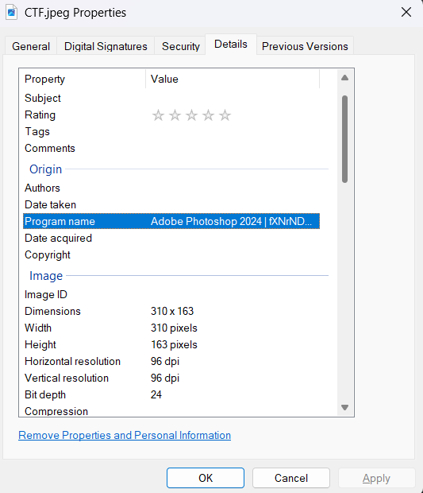

# Echoes After the Aftermath

You are given a image file to find the flag in.

---

## Solution

- For this challenge we are given an image, by instinct we check the metadata first.  Here we find a base64 Encoded string in the program name field.

- Simply converting the base64 back gives us the flag.

---

## Credit

[Stefan Shabbir](https://www.linkedin.com/in/stefan-shabbir/) for solving this challenge.