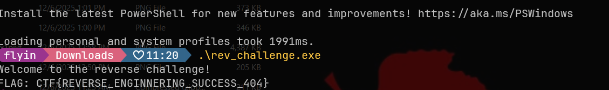

# Foreign Execution

You are given a windows exe file to find the flag.

---

## Solution

- As the challenge implies, you are supposed to run with it to run windows native applications on linux.

- However you can switch to windows and run it as well to get the flag.

---

## Credit

[Mavinda Rodrigo](https://www.linkedin.com/in/mavinda-rodrigo/) for solving this challenge.