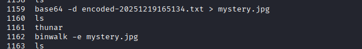
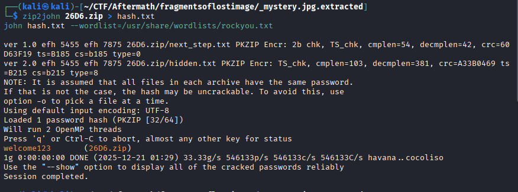

# Fragments of a Lost Image

You are given a text file to solve. It is saved as ```encoded-20251219165134.txt```

---

## Solution

- Download the file and analyze it. The characters seem oddly familiar to some code of an encoding. It is unusual for large files to be encoded so it could also be an image. This is also evidenced by the header. Run the following command to attempt to decode it. For rapid identification and AI tool can help with it.

```sh
base64 -d encoded-20251219165134.txt > mystery.jpg
```

- After running some stegtools it didn't reveal much so let's try binwalk to see if there's any hidden files.

```sh
binwalk -e mystery.jpg
```



- Indeed there is a zip file. Attempting to open it shows that it is password protected. We can solve that by using john the ripper. First convert it to a hash and run a bruteforce to reveal the password.

```sh
zip2john 260D.zip > hash.txt
john hash.txt /usr/share/wordlists/rockyou.txt
```

- The password is revealed as ```welcome123```. Unzip the contents and you'll be presented with two text files.

- Reveal the contents of ```hidden.txt``` from my past experience, it appears to be brainfuck code. Copy the contents and paste it into an online brainfuck interpreter, ```https://copy.sh/brainfuck```



---

## Credit

[Mavinda Rodrigo](https://www.linkedin.com/in/mavinda-rodrigo/) for solving most of the challenge, up until extracting the zip file from the image.
