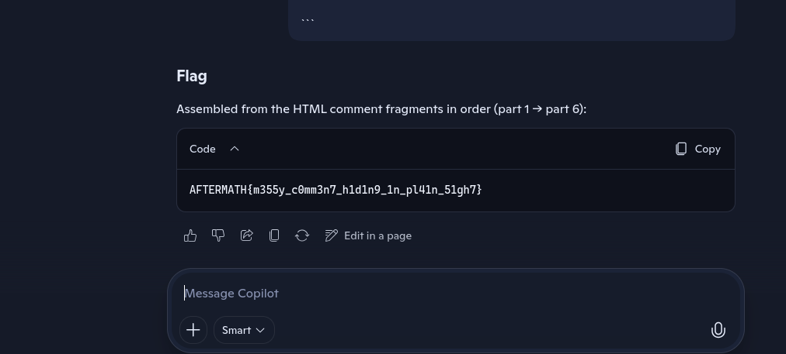

# Illusions of Order

You are given a source html file. It has messy code and you need to find the flag in it which is fragmented.

---

## Description

In systems that appear polished and intentional,
the most revealing truths are rarely rendered on the surface.

This interface was designed to feel complete, stable, and unremarkable.
Yet, like many real-world implementations, its structure carries more meaning
than its presentation.

Some information is not executed.
Some notes are not meant for users.
And some stories are told only in pieces.

Pay attention to what the browser ignores.
What is hidden may be divided, labeled, and incomplete on its own.
Only when every fragment is accounted for does the message become whole.

Order matters. Noise deceives.
Nothing here runs alone.

---

## Solution 

-  AI tools is best for this challenge because it can recognize patterns better than us. The flag is fragmented it in ```part(x/6)``` format.

- Paste the source code into you preferred AI tool and get the flag or manually search for the parts and construct the flag yourselves.


