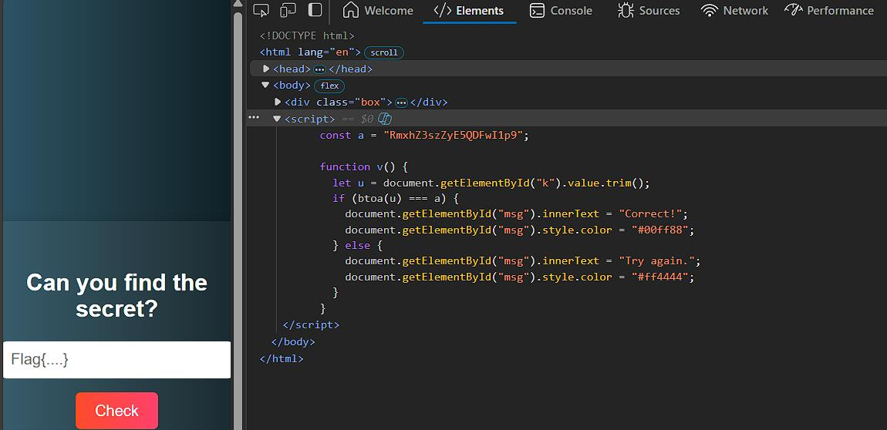

# Key in the Shadows

You are given a website/html to inspect and find the flag.

---

## Solution

- First I have went to the inspect mode of the given html file and there has been a line added where it has mentioned a const a with an encrypted file and then later on  it seemed to be a base64 encoded string.



- After decoding, the flag revealed to be ```Flag{3g!9@p#Z}```

---

## Credit

[Rithila Fernando](https://www.linkedin.com/in/rithila-fernando-721bb1320/) for solving this challenge.