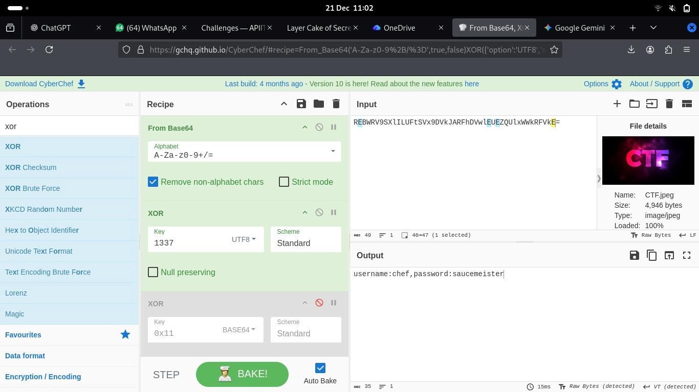
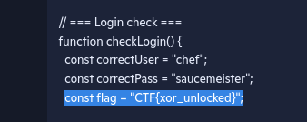
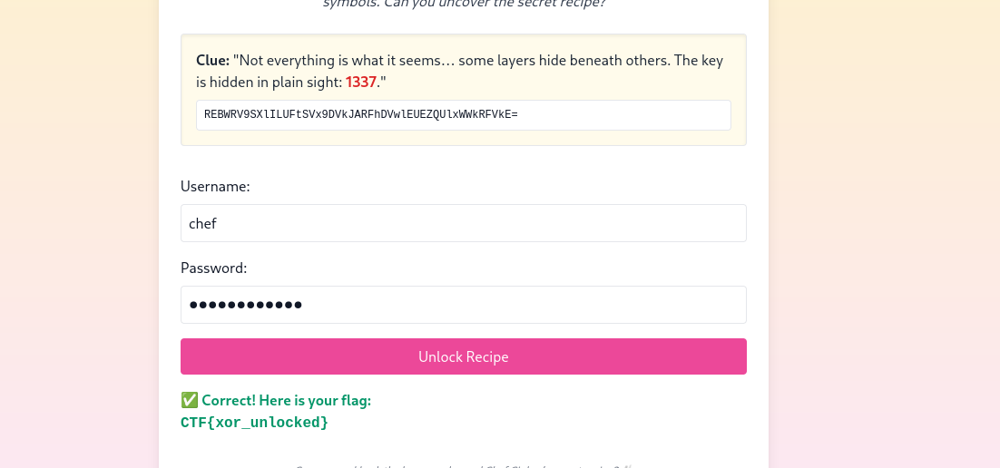

# Layers Cake of Secrets

A site which blocks dev/inspect tool and right click. You are given a base64 encoded string as a lead to solve it.

---

## Description

Chef Cipher was experimenting late into the night, stacking flavors, techniques, and secrets into a single masterpiece. But something went wrong… 😵‍🍳
The recipe was scrambled and locked away, hidden beneath multiple layers of transformation.

What looks simple may not be simple at all. Some layers are obvious, while others only reveal themselves once the first is peeled away. A keen eye will notice that the key is hiding in plain sight, whispered through the language of the elite: 1337.

Your task is to carefully unravel each layer, understand what the data is pretending to be, and extract the information needed to unlock the kitchen terminal. Only those who respect the order of layers will succeed.

Can you slice through the deception and recover Chef Cipher’s secret recipe? 🍴🧠🔓

---

## Solution

- For this challenge the site has give us a key which is ```1337``` and a base4 string, ```REBWRV9SXlILUFtSVx9DVkJARFhDVwlEUEZQUlxWWkRFVkE=```.

- Based on the assumption this is a XOR key we can use to decode the base64 string we enter it into a decoder.



- Then we can enter the credentials and get the flag.

---

## Alternative Solution

- Since the site blocks dev tools and right click, we can try bypassing this with an external site to view the source code like ```https://www.view-page-source.com/```

```html
<!DOCTYPE html>
<html lang="en">
<head>
<meta charset="UTF-8">
<title>Layer Cake of Secrets</title>
<link href="https://cdn.jsdelivr.net/npm/tailwindcss@2.2.19/dist/tailwind.min.css" rel="stylesheet">
<script>
// === Block right-click and dev tools ===
document.addEventListener("contextmenu", e => { e.preventDefault(); alert("🚫 Right-click is disabled!"); });
document.addEventListener("keydown", function(e) {
  if(e.keyCode===123||(e.ctrlKey&&e.shiftKey&&(e.keyCode===73||e.keyCode===74))||(e.ctrlKey&&e.keyCode===85)) {
    e.preventDefault(); alert("🚫 DevTools blocked!"); 
  }
});

// === Login check ===
function checkLogin() {
  const correctUser = "chef";
  const correctPass = "saucemeister";
  const flag = "CTF{xor_unlocked}";

  const user = document.getElementById("username").value.trim();
  const pass = document.getElementById("password").value.trim();
  const result = document.getElementById("result");

  if(user === correctUser && pass === correctPass){
    result.innerHTML = "✅ Correct! Here is your flag:<br><code>" + flag + "</code>";
    result.className = "mt-4 text-green-600 font-bold";
  } else {
    result.innerHTML = "❌ Invalid credentials. Keep peeling those layers!";
    result.className = "mt-4 text-red-600 font-bold";
  }
}
</script>
</head>
<body class="bg-gradient-to-b from-yellow-100 to-pink-100 text-gray-900">
<div class="max-w-2xl mx-auto mt-20 p-6 bg-white shadow-lg rounded-2xl">
  <!-- Story Header -->
  <h1 class="text-3xl font-bold mb-4 text-center">🍰 Layer Cake of Secrets</h1>
  <p class="text-gray-700 mb-6 text-center italic">
    Chef Cipher has been up all night in the kitchen, experimenting with his newest dessert.  
    But the recipe got scrambled! Each ingredient is now hidden in layers of letters and symbols.  
    Can you uncover the secret recipe?
  </p>

  <!-- XOR + Base64 Clue -->
  <div class="mt-6 p-4 bg-yellow-50 border rounded shadow-inner">
    <p class="text-gray-800 mb-2">
      <strong>Clue:</strong> "Not everything is what it seems… some layers hide beneath others.  
      The key is hidden in plain sight: <span class="text-red-600 font-bold">1337</span>."
    </p>
    <p class="mt-2 text-xs font-mono bg-white p-2 border rounded break-all">
      REBWRV9SXlILUFtSVx9DVkJARFhDVwlEUEZQUlxWWkRFVkE=
    </p>
    
  </div>

  <!-- Login Form -->
  <div class="mt-8">
    <label class="block mb-2 font-medium">Username:</label>
    <input type="text" id="username" class="w-full p-2 border rounded mb-4" placeholder="Enter username">
    <label class="block mb-2 font-medium">Password:</label>
    <input type="password" id="password" class="w-full p-2 border rounded mb-4" placeholder="Enter password">
    <button onclick="checkLogin()" class="w-full px-4 py-2 bg-pink-500 text-white rounded hover:bg-pink-600">Unlock Recipe</button>
    <div id="result" class="mt-4"></div>
  </div>

  <!-- Footer Story Note -->
  <p class="mt-8 text-gray-500 text-xs italic text-center">
    Can you peel back the layers and reveal Chef Cipher’s secret recipe? 🍴
  </p>
</div>
</body>
</html>
```

- In the javascript we can see the credentials and the flag. Submit that and we get the flag



- Submitting it to the site itself, we can see it works.



---

## Credit

[Stefan Shabbir](https://www.linkedin.com/in/stefan-shabbir/) for providing the main solution.
