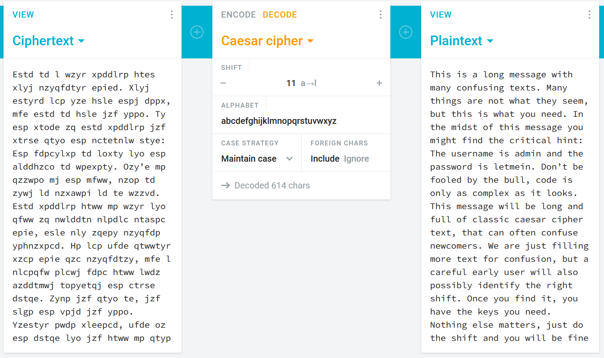

# Login is Just a Distraction

You are given a login page to find the flag with and some encoded text.

---

## Solution

- The first hint that tipped us off was the Domain title being caesar login challenge, referring to the caesar cipher where the letters of a message are shifted by a certain number, the challenge is then finding that exact offset.

- Even though the letters are shifted the words retain the same number of letter so the attack pattern was to find commonly grouped words that have the have recognizable lengths and then unshift the bits till the word makes see if the entire message has been decoded.

- We did this assuming that “td l ” was “is a” and when the message was shifted by exactly 11 the message appeared giving us the username and the password. Which upon entering gave us the flag.

---

## Credit

[Stefan Shabbir](https://www.linkedin.com/in/stefan-shabbir/) for solving this challenge.