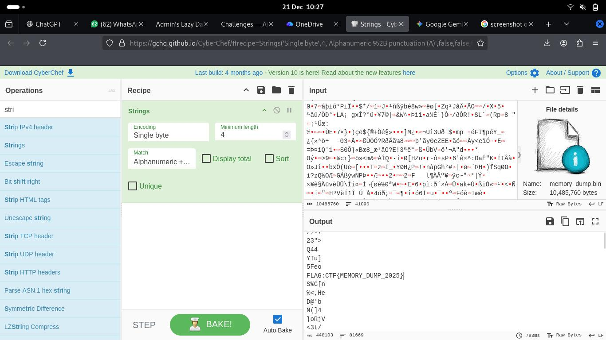

# Memory Matters

You are given a memory dump to analyze and find the flag in.

---

## Solution

- First we inspect the binary file for strings, and it reveals the flag in it.

---

## Credit

[Stefan Shabbir](https://www.linkedin.com/in/stefan-shabbir/) for solving this challenge.