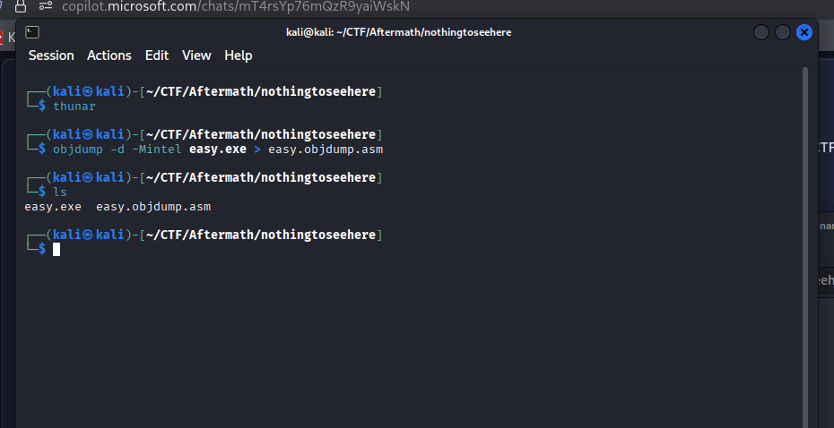
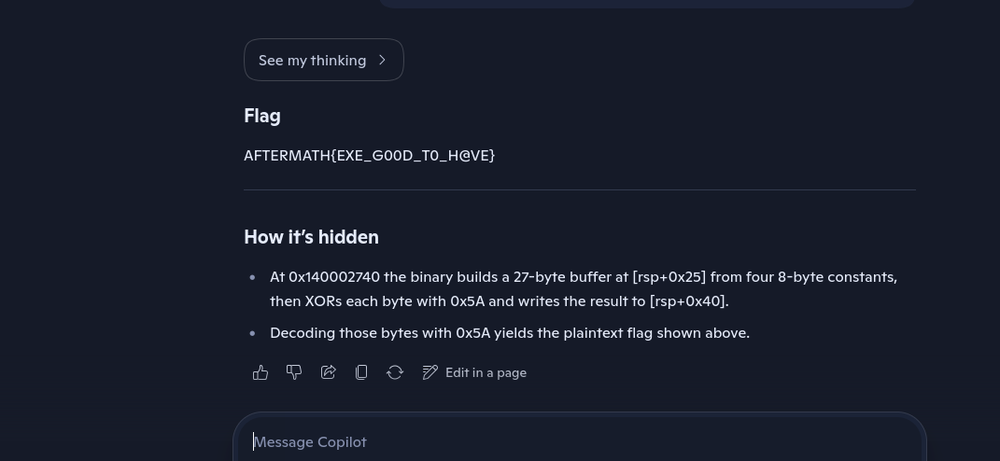

# Nothing to See Here

You are given a windows executable to find the flag.

---

## Description

You’re given a mysterious executable that insists there’s “Nothing to see here :)”.
But in CTFs, binaries rarely tell the whole truth.

The flag is hidden inside the executable itself and is never printed.
Your task is to figure out how the program handles its internal data and recover what it’s hiding.

Flag format: AFTERMATH{...}

“What you seek is not shown — it is transformed, not missing.”

---

## Solution

- It's a windows executable, first let's try strings to see if the flag is there like the last challenge with the ```vuln``` executable.

```sh
strings easy.exe | grep AFTERMATH
```

- No luck, then we must get the decompiled code of it and then run it through an AI tool to identify the flag. Leveraging AI is the best because it can detect patterns and decode complex code.

```sh
objdump -d -Mintel easy.exe > easy.objdump.asm
```



- Paste it into your preferred AI tool and you should get the flag

