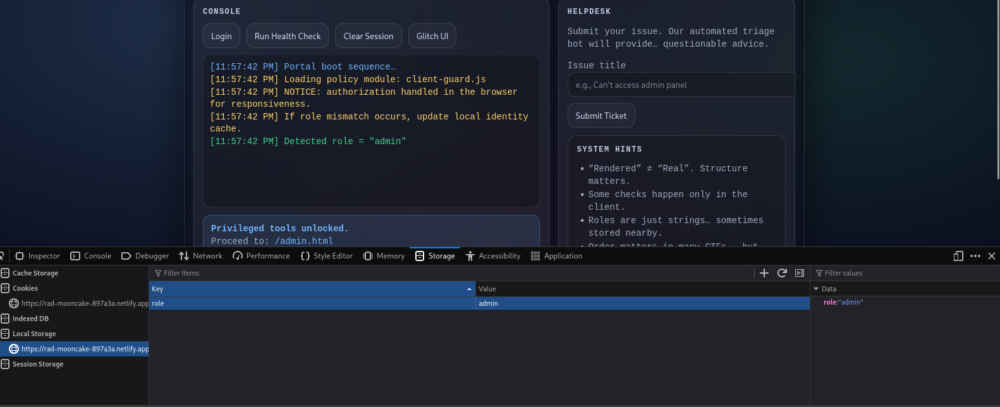

# When Browser Decides Who You Are

You are given a link to a hosted site, there's some functions but on the log by default says you're a user.

## Solution

- In the challenge website it speaks about roles. More often it is done with sessions and local storage. Check them to see what it reveals.

- Indeed it is localstorage. Change it to user and it should update the website. Then head to /admin.html for the flag.

