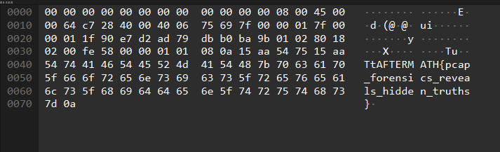

# Whispers in the Stream

You are given a .pcap file to find the flag in among the network traffic.

---

## Solution

- First open ```easy.pcap``` in **wireshark** and take a look at the hint given, *“Even the loudest chatter can hide secrets”, “Somewhere in the flow of data”*  Hints us that the packet is hidden inside the packet payloads. Hence we focus on streams, but not headers.

- Then in order to find the packet files containing the flag I have clicked **Ctrl + F** and the small header pops up.


- I have set the  Find by to String and the search in  Packet Bytes and the character has been set to ASCII and then searched for ``{``.

- It will select one packet and looking inside, it reveals the flag.



---

## Credit

[Rithila Fernando](https://www.linkedin.com/in/rithila-fernando-721bb1320/) for solving this challenge.