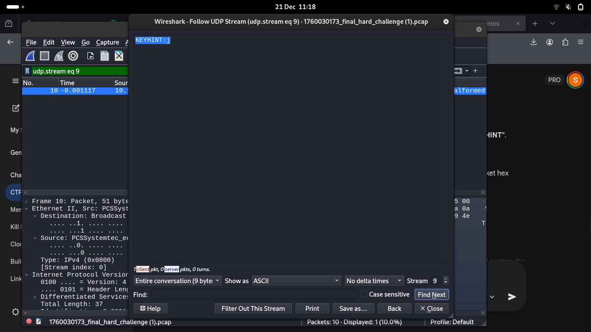

# The XOR Files: A Tale of Obfuscation

You are given a .pcap file with obfuscated packets inside it.

---

## Solution

- First open the file in ```wireshark``` and find the ```KEYHINT```.



---

## Credit

[Stefan Shabbir](https://www.linkedin.com/in/stefan-shabbir/) for solving this challenge.