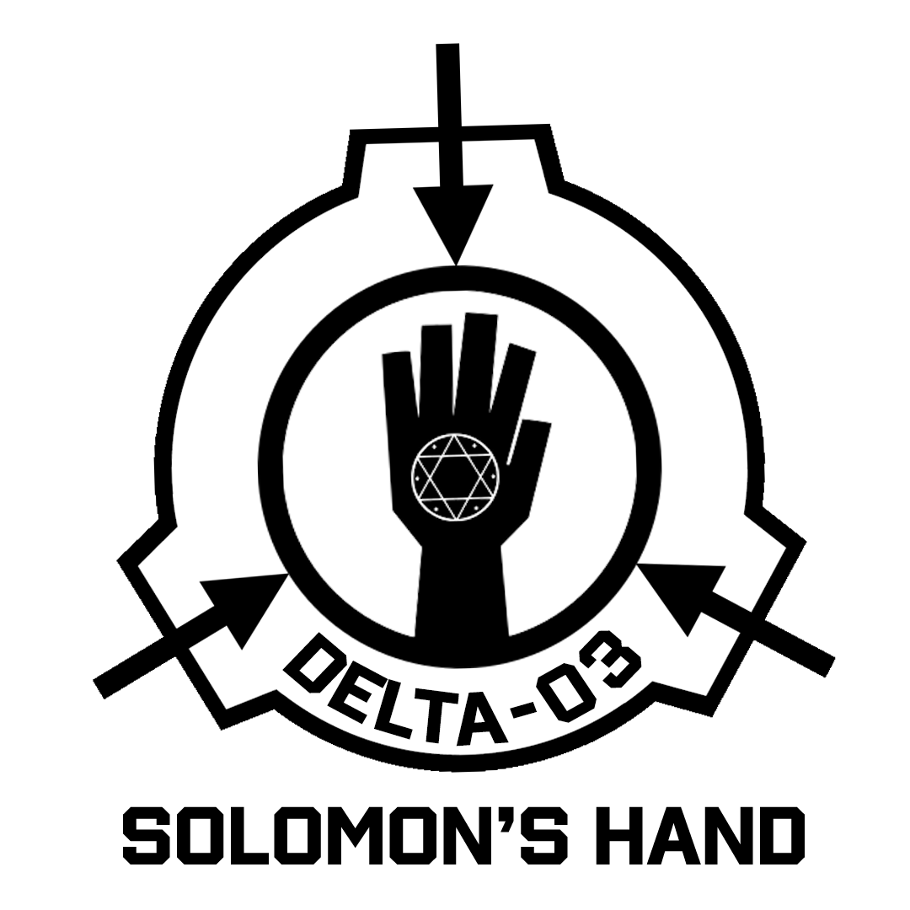

# Prelims Intra-Univeristy CTF (APIIT)

Preliminary CTF qualifier for APIIT's upcoming Inter-University CTF, my teammate Stefan couldn't attend so me alone with *Special Asset Agent - Thunder's Fist* and as team **[Solomon's Hand](https://scp-wiki.wikidot.com/task-forces#delta-3)** achieved **1st place**. Missed out on a few challenges with most of them being solved. Different but improved writeup format since a walktrhough was required (Ugh).

---

  

---

## Challenges

- [✓ Broken Circle](BrokenCircle/writeup.md)
- [✓ Convergence Protocol](ConvergenceProtocol/writeup.md)
- [✓ Echoes Of The Erased](EchoesOfTheErased/writeup.md)
- [✓ Ghost In The Machine](GhostInTheMachine/writeup.md)
- [✓ Overflow Cascade](OverflowCascade/writeup.md)
- [✓ Silent Leak](SilentLeak/writeup.md)
- [✓ Sponsor's Secret](SponsorsSecret/writeup.md)
- [✓ The Open Door](TheOpenDoor/writeup.md)
- [✓ The Oracle's Tongue](TheOraclesTongue/writeup.md)
- [✓ Trojan Ledger](TrojanLedger/writeup.md)
- [✓ Twin Sentinels](TwinSentinels/writeup.md)
- [✓ Whispered Cookies](WhisperedCookies/writeup.md)
